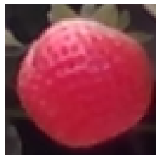
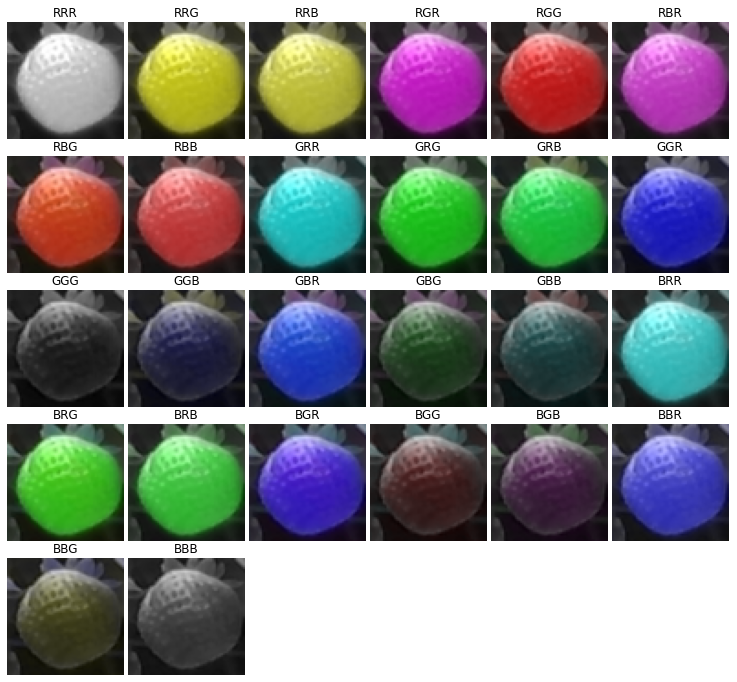
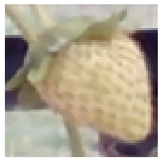
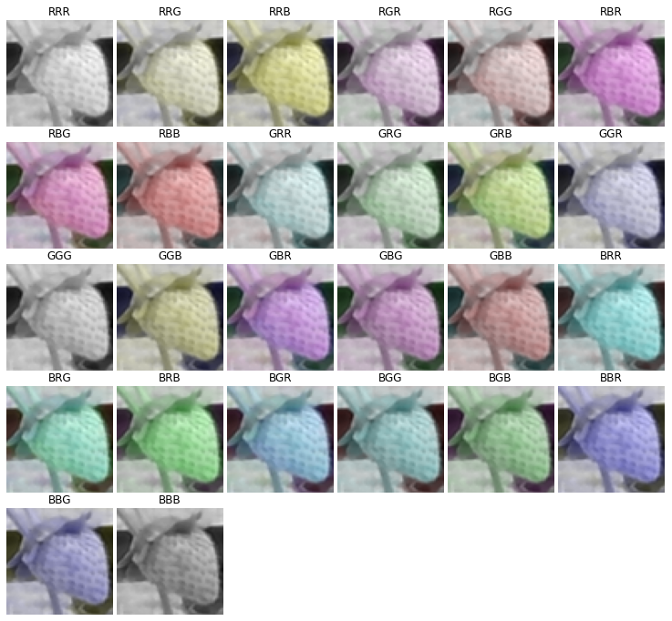
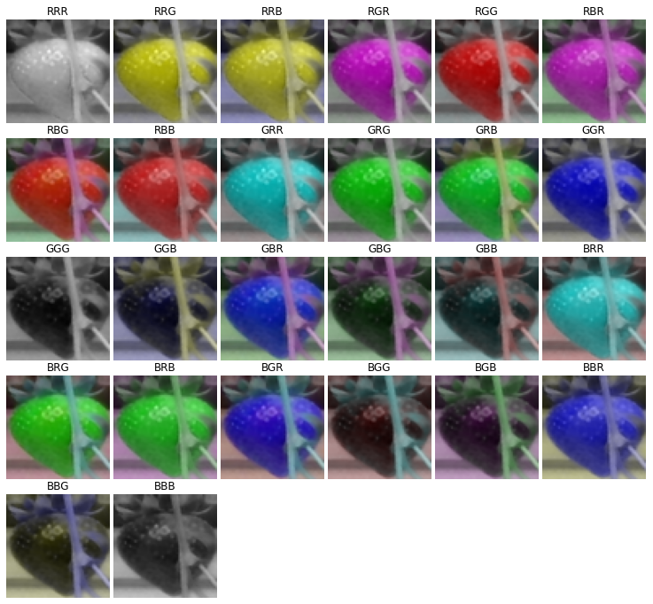

# CH-Rand

*Channel Randomisation* (CH-Rand) is the technique to augment image data by randomising the RGB channels to encourage neural networks to learn normal compositions of "colour" in self-supervised manners. 
This repository is the official release of the codes used for the following preprint: 

*"Self-supervised Representation Learning for Reliable Robotic Monitoring of Fruit Anomalies", Taeyeong Choi, Owen Would, Adrian Salazar-Gomez, and Grzegorz Cielniak, Available at [\[arXiv:2109.10135\]](https://arxiv.org/abs/2109.10135).* 

As explained in the paper, CH-Rand has been designed to solve *fruit anomaly detection* problem in the [One-class Classification](https://en.wikipedia.org/wiki/One-class_classification) scenario, in which classifiers can only access the data of normal instances during training but must be able to identify anomalous instances in test. 
For self-supervised learning, CH-Rand is used to set up the pretext task to classify randomised images `x'=CHR(x)`, where `CHR` permutes the RGB channels in the normal image `x` with a possibility of repeatition (e.g., RRR, RRG, RRB, RGR, ..., BBB) &mdash; i.e., 26 possible `x'` exist excluding the original permutation RGB, as shown in [Examples](https://github.com/ctyeong/CH-Rand#examples) below.

After the proxy task, the learnt feature representations from a middle layer of the classifier can then be utilised to measure the degree of anomaly for tested image samples. To be specific, for each test input, the mean Euclidean distance to the *k* nearest neighbors in the training set is calculated as anomaly score supposing that anomalous images would tend to produce higher mean distances.


# Contents

1. [Examples](https://github.com/ctyeong/CH-Rand#examples)
1. [Installation](https://github.com/ctyeong/CH-Rand#installation)
<!-- 1. [How to Use](https://github.com/ctyeong/Riseholme-2021#how-to-use)

1. [Random Splits](https://github.com/ctyeong/Riseholme-2021#random-splits)

1. [Benchmark Performance](https://github.com/ctyeong/Riseholme-2021#benchmark-performance) -->
1. [Citation](https://github.com/ctyeong/CH-Rand#citation)
1. [Contact](https://github.com/ctyeong/CH-Rand#contact)  

# Examples 

Three examples are displayed below, in each of which the original RGB image of strawberry is followed by 26 possible channel randomised images. 

## Example 1

| **26 Channel Randomisations**  | 
|--------------------|
| | 

## Example 2

| **26 Channel Randomisations**  | 
|--------------------|
| | 

## Example 3

| **26 Channel Randomisations**  | 
|--------------------|
| | 


# Installation


# Citation
```
@article{CWSC21,
    title={Self-supervised Representation Learning for Reliable Robotic Monitoring of Fruit Anomalies}, 
    author={Taeyeong Choi and Owen Would and Adrian Salazar-Gomez and Grzegorz Cielniak},
    year={2021},
    journal={arXiv},
}
```


# Contact

If there is any questions about the dataset, please do not hesitate to drop an email to tchoi@lincoln.ac.uk or gcielniak@lincoln.ac.uk. Thanks!

