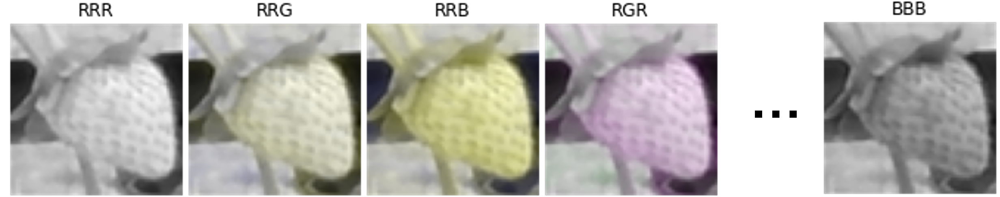

# Channel Randomisation (CH-Rand)

This repository is the official release of the codes used for the following preprint: 

***"Self-supervised Representation Learning for Reliable Robotic Monitoring of Fruit Anomalies"**. Taeyeong Choi, Owen Would, Adrian Salazar-Gomez, and Grzegorz Cielniak.* [\[arXiv:2109.10135\]](https://arxiv.org/abs/2109.10135) 


**Channel Randomisation** (CH-Rand) is the image augmentation technique for "self-supervised learning" of deep neural networks. In particular, CH-Rand randomises the RGB channels in images to encourage neural networks to learn anomalous "colour" compositions whilst classyfing the channel-randomised images
&mdash; a *pretext* task to learn colour-based representations.

**Agricultural robots** (e.g., Thovald above) are targeted plantforms to build vision systems with CH-Rand to successfully solve **fruit anomaly detection** problem. In particular, [One-class Classification](https://en.wikipedia.org/wiki/One-class_classification) is considered, in which the classifiers can only access the data of normal fruit instances but must be able to detect anomalous fruits from tested images. 

**A pretext task** for self-supervised learning is configured by CH-Rand, in which a classifier is to detect channel-randomised images `x'=CHR(x)`, where `CHR` permutes the RGB channels in some normal image `x` with a possibility of repeatition (e.g., RRR, RRG, RRB, RGR, ..., or BBB) &mdash; i.e., 26 possible permuation outcomes for `x'` exist excluding RGB, as shown below and in more in [Examples](https://github.com/ctyeong/CH-Rand#examples).



**Representations** learnt at a middle layer of the classifier during the pretext task can then be utilised to measure the degree of anomaly for tested image samples. More specifically, for each test input, the mean *Euclidean* distance to the *k* nearest neighbors in the training set is calculated as anomaly score supposing that anomalous images would tend to produce higher mean distances.

**Another useful reading** is the following article from Jack Clark's weekly newsletter on AI:
[Import AI 267: Tigers VS humans; synthetic voices; agri-robots](https://jack-clark.net/2021/09/27/import-ai-267-tigers-vs-humans-synthetic-voices-agri-robots/). This was a very informative introduction where even busy readers could easily understand from his concise paragraphs the main strengths and distictions in CH-Rand. 


# Contents

1. [Examples](https://github.com/ctyeong/CH-Rand#examples)
1. [Installation](https://github.com/ctyeong/CH-Rand#installation)
1. [Training](https://github.com/ctyeong/CH-Rand#training)
1. [Test](https://github.com/ctyeong/CH-Rand#test)
1. [Performance on Riseholme-2021](https://github.com/ctyeong/CH-Rand#performance-on-riseholme-2021)
1. [Citation](https://github.com/ctyeong/CH-Rand#citation)
1. [Contact](https://github.com/ctyeong/CH-Rand#contact)  

# Examples 

Three examples are displayed below, in each of which the original RGB image of strawberry is followed by 26 possible channel randomised images. 

## Example 1

| **26 Channel Randomisations**  | 
|--------------------|
| | 

## Example 2

| **26 Channel Randomisations**  | 
|--------------------|
| | 

## Example 3

| **26 Channel Randomisations**  | 
|--------------------|
| | 


# Installation

1. Clone the repository
    ```
    $ git clone https://github.com/ctyeong/CH-Rand.git
    ```

2. Install the required Python packages
    ```
    $ pip install -r requirements.txt -f https://download.pytorch.org/whl/torch_stable.html
    ```
    - Python 3.8 is assumed to be installed already.


# Training

Training is performed on a deep-network classifier to differentiate channel-randomised images from the images without any randomisation. 
For training, you essentially need: 
1. Dataset 
1. Config File 

## Dataset
In this tutorial, we assume that [Riseholme-2021](https://github.com/ctyeong/Riseholme-2021) &mdash; the large image dataset for strawberry anomaly detection available [here](https://github.com/ctyeong/Riseholme-2021)
&mdash; has been cloned inside the root directory of `CH-Rand`. 
Even if a custom dataset is used, the current version of CH-Rand can be executed without major modification, as long as the same directory structure is adopted as in Riseholme-2021. 

## Config File
Prepare a configuration file with the extension of `.yaml` to pass required hyper parameters, such as data path, learning rate, image size, and extras. 
Use `Configs/config.yaml` as a template to provide your own parameters if necessary. Some of the parameters are explained below:

- `fc_feat`: Feature representations are extracted from the fully connected layer instead of the last convolutional layer during regular tests.
- `n_neighbors`: Numbers of neighbors to use for distance calculation in regular tests.
- `epoch_size`: One epoch consists of `epoch_size` batch updates as opposed to the traditional concept, where all training samples are involved per epoch.
- `aug_mode`: One in {CH-Rand, CH-Perm, CH-Split} is usable, and read the paper above to learn how each works. 
- `portion`: [0., 1.] to determine proportionally how many pixels get affected by the predefined randomisation &mdash; i.e., 0: None and 1: All pixels. For 0<`portion`<1, pixels of similar intensities are selected once the input image has been converted to its grayscale version.
- `stop_criterion`: Training stops if the validation accuracy exceeds `val_acc_threshold` this number of times in a row.


## Learning Pretext Task

Run the following command to train a deep-network classifier to differentiate the images `x` and the channel-randomised images `x'`:
```
$ python train.py -c Config/config.yaml
```
- Replace the config file `Config/config.yaml` with your own if you have one. You will see the outputs as below depending on your hyperparameters in the config file:
    ```
    ......
    ......
    Fit ================================
    Epoch 26/26
    8/8 - 0s - loss: 1.2755 - accuracy: 0.9404 - val_loss: 1.6665 - val_accuracy: 0.6279
    0.460 seconds to fit the model with lr=5.0e-06

    Test ================================
    # of neighbors=1, AUC-ROC = 0.904, AUC-PR = 0.938
    # of neighbors=3, AUC-ROC = 0.908, AUC-PR = 0.944
    # of neighbors=5, AUC-ROC = 0.910, AUC-PR = 0.946
    25.000: AUC-ROC = 0.910, AUC-PR = 0.946
    2.266 seconds to test the model

    Validate ================================
    no change to the max val_accuracy=0.732
    ......
    ......
    ```
- Training will continue until either the `stop_criterion` is met, or `n_epochs` has passed.
- While the training is performed, you can monitor the progress using [Tensorboard](https://www.tensorflow.org/tensorboard). Under the default settings, run the below command in another terminal session:
    ```
    $ tensorboard --logdir=tb_logs
    ```
    - Match `tb_logs` with the path of `tensorboard_dir` in your config file.

As the training ends, the best model with the maximum validation accuracy has been saved at `model_dir` set in your config file &mdash; e.g., `saved_models/20211001-201050.h5`, with the file name deteremined by the execution time of `train.py`. This file basically contains the weights of the trained classifier, which are essential to run [Test](https://github.com/ctyeong/CH-Rand#test).


# Test

Similar to training, you need the dataset and config file &mdash; e.g., `Configs/config.yaml`. The additional parameter in the config file is
`model_path` nested under `test`. 
Set it to the path generated under `model_dir` after training as the below example:

```
...
test:{
    model_path: saved_models/20211001-201050.h5
}
```

Now you are ready to run the test: 

```
$ python test.py -c Configs/config.yaml 
```

You will see your model loaded and the final evaluation results on test data as the below example depending on its performance:

```
......
......
Evaluation results ================================
1 neighbor(s): AUC-ROC = 0.908, AUC-PR = 0.941
3 neighbor(s): AUC-ROC = 0.912, AUC-PR = 0.947
5 neighbor(s): AUC-ROC = 0.913, AUC-PR = 0.949
10 neighbor(s): AUC-ROC = 0.915, AUC-PR = 0.950
```


# Performance on Riseholme-2021

Here are brief evaluation results of CH-Rand and its variant &mdash; CH-Perm &mdash; on [Riseholme-2021](https://github.com/ctyeong/Riseholme-2021), but you are encouraged to read the paper above to find more extensive results with settings in detail. CH-Perm is not to allow for repetition in RGB permuations, resulting in 5 possible channel-randomised images.
<!-- - CH-Split: Value at an arbitrary channel is duplicated across other two, producing 3 possible channel-randomised images. -->

| Normal Category | Metric  |   CH-Perm (*k=1*) | CH-Perm (*k=5*) | CH-Rand (*k=1*) | CH-Rand (*k=5*) | 
| --------------- | ---------| ------------------|---------------|---------------|---------------|
| Ripe                     | ROC | .918 | **.922** | .920     | **.922** | 
|                          | PR  | .949 | .954     | .955     | **.957** | 
| Unripe                   | ROC | .874 | **.876** | .873     | .870     | 
|                          | PR  | .709 | .721     | .755     | **.765** | 
| Ripe & Unripe            | ROC | .826 | .829     | .834     | **.838** | 
|                          | PR  | .572 | .580     | .607     | **.615** | 
| Ripe & Unripe            | ROC | .795 | .790     | **.804** | .796 | 
|  & Occluded              | PR  | .458 | .436     | **.496** | .484 | 

* Each score is the average AUC from three individual test runs on Split 1. 
* *k* represents the number of nearest neighbors considered for distance calculation.
* Images from normal category were available during training for detection of anomalous strawberry images in tests 


# Citation
```
@article{CWSC21,
    title={Self-supervised Representation Learning for Reliable Robotic Monitoring of Fruit Anomalies}, 
    author={Taeyeong Choi and Owen Would and Adrian Salazar-Gomez and Grzegorz Cielniak},
    year={2021},
    journal={arXiv},
}
```


# Contact

If there is any questions about the dataset, please do not hesitate to drop an email to tchoi@lincoln.ac.uk or gcielniak@lincoln.ac.uk. Thanks!

