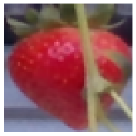

# CH-Rand

*Channel Randomisation* (CH-Rand) is the technique to augment image data by randomising the RGB channels to encourage neural networks to learn normal compositions of "colour" in self-supervised manners. 
This repository is the official release of the codes used for the following preprint: 

*"Self-supervised Representation Learning for Reliable Robotic Monitoring of Fruit Anomalies", Taeyeong Choi, Owen Would, Adrian Salazar-Gomez, and Grzegorz Cielniak, Available at [\[arXiv:2109.10135\]](https://arxiv.org/abs/2109.10135).* 

As explained in the paper, CH-Rand has been designed to solve *fruit anomaly detection* problem in the [One-class Classification](https://en.wikipedia.org/wiki/One-class_classification) scenario, in which classifiers can only access the data of normal instances during training but must be able to identify anomalous instances in test. 
For self-supervised learning, CH-Rand sets up the pretext task to classify randomised images `x'=CHR(x)`, where `CHR` permutes the RGB channels in the normal image `x` with a possibility of repeatition (e.g., RRR, RRG, RRB, RGR, ..., BBB) &mdash; i.e., 26 possible `x'` exist excluding the original permutation RGB.

# Contents

1. [Examples](https://github.com/ctyeong/CH-Rand#examples)

<!-- 1. [Statistics](https://github.com/ctyeong/Riseholme-2021#statistics)

1. [How to Use](https://github.com/ctyeong/Riseholme-2021#how-to-use)

1. [Random Splits](https://github.com/ctyeong/Riseholme-2021#random-splits)

1. [Benchmark Performance](https://github.com/ctyeong/Riseholme-2021#benchmark-performance)

1. [Citation](https://github.com/ctyeong/Riseholme-2021#citation)

1. [Contact](https://github.com/ctyeong/Riseholme-2021#contact)  -->

# Examples 

| Example 1  | 
|--------------------|
| | 
| **26 Channel Randomisations**  | 
| | 

| Example 2  | 
|--------------------|
| | 
| **26 Channel Randomisations**  | 
| | 

| Example 3  | 
|--------------------|
| | 
| **26 Channel Randomisations**  | 
| | 
